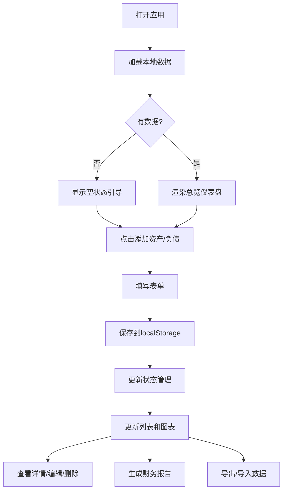

## 1. 产品概述

一个运行在手机浏览器中的轻量H5资产管理工具，帮助用户全面掌握个人财务健康状况。所有数据存储在浏览器本地，无需注册或联网，保护个人隐私。

- 核心目标：帮助用户轻松管理个人资产与负债，实时掌握财务状况
- 目标用户：需要管理个人财务、关注资产负债情况的普通用户
- 产品价值：本地存储、隐私安全、离线可用、图表可视化、智能提醒

## 2. 核心功能

### 2.1 用户角色
无需注册，单用户模式，所有数据仅存储在本地浏览器。

### 2.2 功能模块
1. **总览仪表盘**：核心数据卡片、净值趋势图、资产/负债结构图、到期提醒横幅、快捷操作
2. **资产管理**：资产列表（分类分组）、添加资产、资产详情、变更记录
3. **负债管理**：负债列表（分类分组）、添加负债、负债详情、还款记录、还款提醒
4. **我的页面**：财务报告（月度/年度）、提醒管理、数据导入导出、清除数据、设置

### 2.3 页面详情
| 页面名称 | 模块名称 | 功能描述 |
|-----------|-------------|---------------------|
| 总览 | 核心数据卡片 | 展示总资产、总负债、净资产，支持千分位格式化 |
| 总览 | 净值趋势图 | Canvas折线图展示近6/12个月净资产变化 |
| 总览 | 资产结构图 | Canvas环形图展示各资产类别占比 |
| 总览 | 负债结构图 | Canvas环形图展示各负债类别占比 |
| 总览 | 到期提醒横幅 | 展示未来7天内到期的存款和需还款的负债 |
| 总览 | 快捷操作 | 浮动"+"按钮快速添加资产或负债 |
| 资产 | 资产列表 | 按类别分组展示，支持分类筛选、金额排序 |
| 资产 | 添加资产 | 表单输入：名称、类别、估值、成本、备注、日期、到期日、利率、照片 |
| 资产 | 资产详情 | 展示全部字段，支持编辑、删除，显示变更历史时间轴 |
| 资产 | 变更记录 | 自动记录每次金额变动，时间轴展示 |
| 负债 | 负债列表 | 按类别分组，展示还款日、月还款额，支持紧迫度排序 |
| 负债 | 添加负债 | 表单输入：名称、类别、总借款、剩余应还、月还款、利率、期限、还款日、备注 |
| 负债 | 负债详情 | 展示全部字段，支持编辑、删除，添加还款记录 |
| 负债 | 还款记录 | 时间轴展示还款历史，支持新增还款操作 |
| 我的 | 财务报告 | 月度/年度报告生成，卡片+文字摘要展示 |
| 我的 | 数据管理 | JSON/CSV导出、JSON导入、清除所有数据（二次确认） |
| 我的 | 设置 | 货币单位、提醒提前天数、自动快照开关 |

## 3. 核心流程

### 3.1 主要用户流程
用户打开应用 → 查看总览仪表盘（数据卡片+图表）→ 点击浮动按钮添加资产/负债 → 填写表单保存 → 数据自动更新到列表和图表 → 在详情页查看历史记录 → 在我的页面生成报告或导出数据

### 3.2 业务流程图

## 4. 用户界面设计

### 4.1 设计风格
- **主色调**：深蓝 `#1e3a5f`（专业金融感）、金色 `#d4a84b`（财富象征）
- **辅助色**：正收益绿 `#10b981`、负收益红 `#ef4444`、中性灰 `#6b7280`
- **背景色**：浅灰 `#f8fafc` 主背景、纯白 `#ffffff` 卡片背景
- **按钮风格**：圆角胶囊按钮，主按钮深蓝填充配金色描边
- **字体**：系统默认字体，数字使用等宽字体增强可读性
- **布局风格**：卡片式布局，圆角12px，柔和阴影
- **图标风格**：使用lucide-react线性图标

### 4.2 页面设计概述
| 页面名称 | 模块名称 | UI元素 |
|-----------|-------------|-------------|
| 总览 | 核心数据卡片 | 渐变背景卡片、大字号数字、趋势箭头、千分位格式 |
| 总览 | 图表区域 | Canvas绘制、响应式尺寸、图例点击交互 |
| 总览 | 提醒横幅 | 顶部橙色/红色警示条、倒计时显示、可点击跳转 |
| 资产/负债 | 列表项 | 左图标+名称、右金额+日期、卡片式分组、分类彩色标签 |
| 表单页 | 输入框 | 左侧标签、右侧输入、金额数字键盘、日期选择器 |
| 详情页 | 信息区 | 字段-值垂直排列、照片预览、操作按钮组 |
| 详情页 | 时间轴 | 左侧竖线+圆点、右侧日期+金额变化 |

### 4.3 响应式
- 移动端优先设计，最大宽度480px居中展示
- 适配iPhone SE到iPhone Pro Max等主流手机尺寸
- 触摸优化：按钮最小高度44px，间距充足
- 底部Tab导航固定，内容区域可滚动

### 4.4 动效设计
- 页面切换：左右滑动过渡动画
- 列表项：入场渐显+上移动画（stagger延迟）
- 数字变化：滚动计数器动画
- 图表绘制：渐进式描边动画
- 点击反馈：缩放+透明度变化
