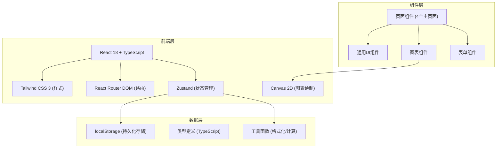
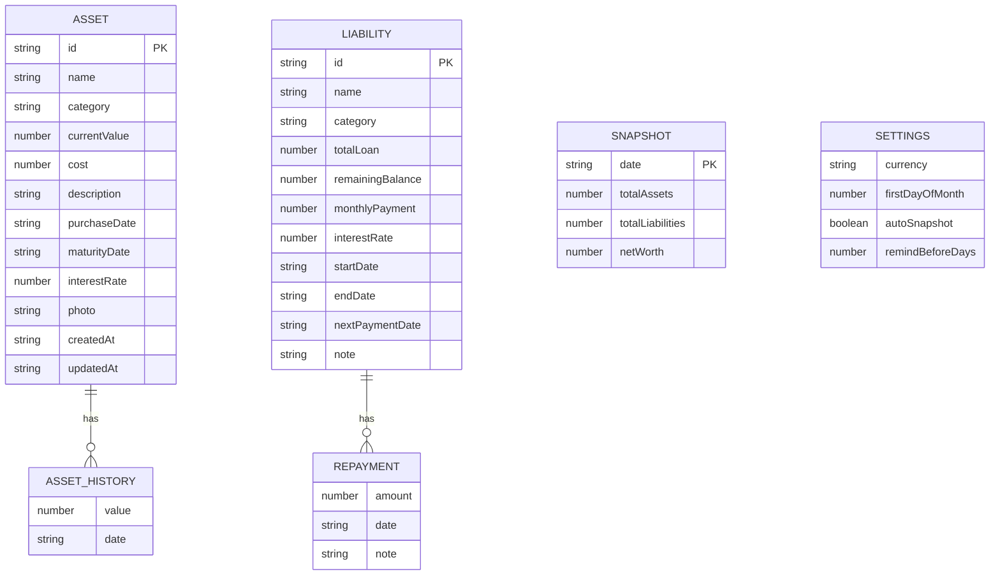

## 1. 架构设计



## 2. 技术描述
- **前端框架**：React 18 + TypeScript
- **构建工具**：Vite
- **样式方案**：Tailwind CSS 3
- **状态管理**：Zustand
- **路由方案**：React Router DOM v6
- **图标库**：lucide-react
- **图表方案**：自研 Canvas 2D 图表（折线图、环形图）
- **数据存储**：浏览器 localStorage
- **后端**：无（纯前端应用，本地计算）

## 3. 路由定义
| Route | Purpose |
|-------|---------|
| `/` | 总览仪表盘（首页） |
| `/assets` | 资产列表页 |
| `/assets/add` | 添加资产页 |
| `/assets/:id` | 资产详情页 |
| `/assets/edit/:id` | 编辑资产页 |
| `/liabilities` | 负债列表页 |
| `/liabilities/add` | 添加负债页 |
| `/liabilities/:id` | 负债详情页 |
| `/liabilities/edit/:id` | 编辑负债页 |
| `/profile` | 我的页面 |
| `/profile/report` | 财务报告页 |
| `/profile/settings` | 设置页 |

## 4. 数据模型

### 4.1 数据模型定义


### 4.2 TypeScript 类型定义
```typescript
// 资产变更记录
interface AssetHistory {
  value: number;
  date: string;
}

// 资产
interface Asset {
  id: string;
  name: string;
  category: string;
  currentValue: number;
  cost?: number;
  description?: string;
  purchaseDate?: string;
  maturityDate?: string;
  interestRate?: number;
  photo?: string;
  createdAt: string;
  updatedAt: string;
  history: AssetHistory[];
}

// 还款记录
interface Repayment {
  amount: number;
  date: string;
  note?: string;
}

// 负债
interface Liability {
  id: string;
  name: string;
  category: string;
  totalLoan: number;
  remainingBalance: number;
  monthlyPayment: number;
  interestRate?: number;
  startDate?: string;
  endDate?: string;
  nextPaymentDate?: string;
  note?: string;
  repayments: Repayment[];
}

// 月度快照
interface Snapshot {
  date: string;
  totalAssets: number;
  totalLiabilities: number;
  netWorth: number;
}

// 设置
interface Settings {
  currency: string;
  firstDayOfMonth: number;
  autoSnapshot: boolean;
  remindBeforeDays: number;
}

// 全局状态
interface AppState {
  assets: Asset[];
  liabilities: Liability[];
  snapshots: Snapshot[];
  settings: Settings;
}
```

## 5. 项目目录结构
```
src/
├── components/          # 通用组件
│   ├── charts/          # Canvas图表组件
│   │   ├── LineChart.tsx
│   │   └── DonutChart.tsx
│   ├── layout/          # 布局组件
│   │   ├── BottomNav.tsx
│   │   └── Header.tsx
│   ├── common/          # 通用UI
│   │   ├── Card.tsx
│   │   ├── Button.tsx
│   │   ├── EmptyState.tsx
│   │   ├── Timeline.tsx
│   │   └── Modal.tsx
│   └── form/            # 表单组件
│       ├── AmountInput.tsx
│       ├── DatePicker.tsx
│       └── CategorySelect.tsx
├── pages/               # 页面组件
│   ├── Overview/        # 总览页
│   ├── Assets/          # 资产页
│   ├── Liabilities/     # 负债页
│   └── Profile/         # 我的页
├── store/               # Zustand状态管理
│   └── useStore.ts
├── utils/               # 工具函数
│   ├── storage.ts       # localStorage封装
│   ├── format.ts        # 金额/日期格式化
│   ├── calculate.ts     # 财务计算
│   └── id.ts            # ID生成
├── types/               # 类型定义
│   └── index.ts
├── constants/           # 常量配置
│   └── categories.ts    # 预设分类
├── hooks/               # 自定义Hooks
│   ├── useReminders.ts
│   └── useSnapshot.ts
├── App.tsx
├── main.tsx
└── index.css
```

## 6. 核心模块说明

### 6.1 数据存储层 (utils/storage.ts)
- 封装 localStorage 读写操作
- 支持数据序列化/反序列化
- 自动持久化 Zustand 状态变更
- 存储容量检查（不超过4MB）

### 6.2 状态管理层 (store/useStore.ts)
- 资产的增删改查（含变更历史记录）
- 负债的增删改查（含还款记录）
- 月度快照管理
- 设置项管理
- 数据导入导出

### 6.3 图表组件 (components/charts/)
- **LineChart**: Canvas折线图，支持多数据点、渐变色填充、坐标轴、动画
- **DonutChart**: Canvas环形图，支持多类别、图例、悬停高亮、动画

### 6.4 提醒机制 (hooks/useReminders.ts)
- 检查未来N天内到期的资产
- 检查未来N天内需还款的负债
- 今日还款高亮标记
- 返回提醒列表供首页横幅展示

### 6.5 快照机制 (hooks/useSnapshot.ts)
- 每月自动生成净资产快照
- 手动触发快照生成
- 快照数据用于趋势图绘制
